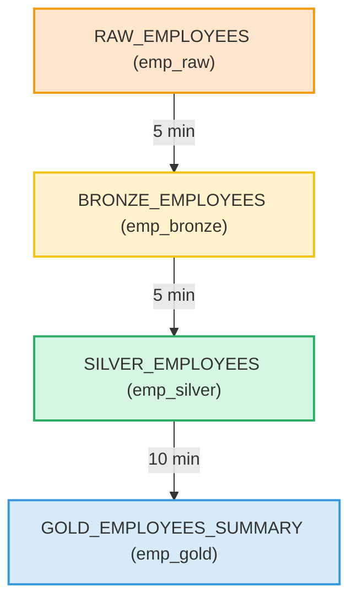

<div class="custom-page-style">

# **🏗️ Snowflake Dynamic Tables ETL Pipeline — End-to-End Hands-on**

This guide walks you through building a **multi-layer ETL pipeline** in Snowflake using **Dynamic Tables** — the modern way to automate incremental transformations **without Tasks or Streams**.

---

## **🔶 Pipeline Architecture**

Below is the **data flow** between layers:

```text
                ┌──────────────────┐
                │   RAW LAYER      │
                │  (emp_raw)       │
                │ Source data load │
                └────────┬─────────┘
                         │
                         ▼
                ┌──────────────────┐
                │  BRONZE LAYER    │
                │  (emp_bronze)    │
                │  Structured copy │
                └────────┬─────────┘
                         │
                         ▼
                ┌──────────────────┐
                │  SILVER LAYER    │
                │  (emp_silver)    │
                │ Clean & Standard │
                └────────┬─────────┘
                         │
                         ▼
                ┌──────────────────┐
                │   GOLD LAYER     │
                │  (emp_gold)      │
                │ Aggregate & KPIs │
                └──────────────────┘
````

💡 Each Dynamic Table automatically refreshes its data from the **upstream table**, based on the configured **LAG interval**.

---

## **1️⃣ Database & Schema Setup**

Create dedicated structures for each stage of your ETL pipeline.

```sql
CREATE OR REPLACE DATABASE demo_emp_db;

CREATE OR REPLACE SCHEMA demo_emp_db.emp_raw;      -- Raw data ingestion
CREATE OR REPLACE SCHEMA demo_emp_db.emp_bronze;   -- Structured data
CREATE OR REPLACE SCHEMA demo_emp_db.emp_silver;   -- Standardized data
CREATE OR REPLACE SCHEMA demo_emp_db.emp_gold;     -- Aggregated analytics
```

✅ **Expected Output:**

```
Database DEMO_EMP_DB created.
Schemas EMP_RAW, EMP_BRONZE, EMP_SILVER, EMP_GOLD created.
```

---

## **2️⃣ Raw Layer — Source Data (`emp_raw`)**

The **Raw Layer** represents the ingestion zone.
Here, we manually insert sample employee records.

```sql
USE SCHEMA demo_emp_db.emp_raw;

CREATE OR REPLACE TABLE raw_employees (
    employee_id INT,
    name STRING,
    department STRING,
    salary NUMBER(10,2),
    joining_date DATE,
    location STRING
);

INSERT INTO raw_employees VALUES
(101, 'alice stewart', 'Finance', 75000, '2022-01-15', 'Bangalore'),
-- (102, 'bob', 'IT', 90000, '2021-07-20', 'Hyderabad'),
-- (103, 'charlie', 'HR', 65000, '2023-03-10', 'Chennai'),
(104, 'Bob 104', 'IT IT', 90000, '2021-07-20', 'Hyderabad');
```

✅ **Sample Output:**

| EMPLOYEE_ID | NAME          | DEPARTMENT | SALARY   | JOINING_DATE | LOCATION  |
| ----------- | ------------- | ---------- | -------- | ------------ | --------- |
| 101         | alice stewart | Finance    | 75000.00 | 2022-01-15   | Bangalore |
| 104         | Bob 104       | IT IT      | 90000.00 | 2021-07-20   | Hyderabad |

```sql
-- Update to trigger downstream changes
UPDATE raw_employees 
SET name = 'alice in wonderland'
WHERE employee_id = 101;
```

✅ **Purpose:** Updating source data triggers automatic refresh downstream.

---

## **3️⃣ Bronze Layer — Structured Copy (`emp_bronze`)**

The **Bronze Dynamic Table** copies structured data from the raw table.
It automatically syncs every 5 minutes.

```sql
USE SCHEMA demo_emp_db.emp_bronze;

CREATE OR REPLACE DYNAMIC TABLE bronze_employees
LAG = '5 MINUTE'
WAREHOUSE = etl_wh
AS
SELECT
    employee_id,
    name,
    department,
    salary,
    joining_date,
    location
FROM demo_emp_db.emp_raw.raw_employees;
```

```sql
ALTER DYNAMIC TABLE demo_emp_db.emp_bronze.bronze_employees REFRESH;
```

✅ **Expected Output:**

```
Dynamic Table BRONZE_EMPLOYEES successfully refreshed.
```

✅ **Sample Output:**

| EMPLOYEE_ID | NAME                | DEPARTMENT | SALARY   | JOINING_DATE | LOCATION  |
| ----------- | ------------------- | ---------- | -------- | ------------ | --------- |
| 101         | alice in wonderland | Finance    | 75000.00 | 2022-01-15   | Bangalore |
| 104         | Bob 104             | IT IT      | 90000.00 | 2021-07-20   | Hyderabad |

---

## **4️⃣ Silver Layer — Clean & Transform (`emp_silver`)**

The **Silver Layer** standardizes text and cleans up inconsistencies.

```sql
USE SCHEMA demo_emp_db.emp_silver;

CREATE OR REPLACE DYNAMIC TABLE silver_employees
LAG = '5 MINUTE'
WAREHOUSE = etl_wh
AS
SELECT
    employee_id,
    INITCAP(TRIM(name)) AS name,          -- Capitalize each word
    UPPER(TRIM(department)) AS department, -- Make department uppercase
    salary,
    joining_date
FROM demo_emp_db.emp_bronze.bronze_employees;
```

```sql
ALTER DYNAMIC TABLE demo_emp_db.emp_silver.silver_employees REFRESH;
```

✅ **Sample Output:**

| EMPLOYEE_ID | NAME                | DEPARTMENT | SALARY   | JOINING_DATE |
| ----------- | ------------------- | ---------- | -------- | ------------ |
| 101         | Alice In Wonderland | FINANCE    | 75000.00 | 2022-01-15   |
| 104         | Bob 104             | IT IT      | 90000.00 | 2021-07-20   |

---

## **5️⃣ Gold Layer — Aggregation & KPIs (`emp_gold`)**

The **Gold Layer** aggregates analytics-ready data.
It summarizes employee information by department.

```sql
USE SCHEMA demo_emp_db.emp_gold;

CREATE OR REPLACE DYNAMIC TABLE gold_employees_summary
LAG = '10 MINUTE'
WAREHOUSE = etl_wh
AS
SELECT
    department,
    COUNT(*) AS total_employees,
    ROUND(AVG(salary), 2) AS avg_salary
FROM demo_emp_db.emp_silver.silver_employees
GROUP BY department;
```

```sql
ALTER DYNAMIC TABLE demo_emp_db.emp_gold.gold_employees_summary REFRESH;
```

✅ **Sample Output:**

| DEPARTMENT | TOTAL_EMPLOYEES | AVG_SALARY |
| ---------- | --------------- | ---------- |
| FINANCE    | 1               | 75000.00   |
| IT IT      | 1               | 90000.00   |

---

## **6️⃣ Validation — Compare Layers**

```sql
-- Check all layers
SELECT * FROM demo_emp_db.emp_raw.raw_employees;
SELECT * FROM demo_emp_db.emp_bronze.bronze_employees;
SELECT * FROM demo_emp_db.emp_silver.silver_employees;
SELECT * FROM demo_emp_db.emp_gold.gold_employees_summary;
```

✅ **Observation:**

* Changes in `RAW_EMPLOYEES` propagate automatically to `BRONZE`, `SILVER`, and `GOLD`.
* No manual MERGE or Task scheduling required.

---

## **7️⃣ Monitoring Dynamic Tables**

Track refresh timings and dependencies.

```sql
SHOW DYNAMIC TABLES IN DATABASE demo_emp_db;

SELECT * 
FROM TABLE(INFORMATION_SCHEMA.DYNAMIC_TABLE_REFRESH_HISTORY());
```

✅ **Sample Output:**

| TABLE_NAME             | STATUS     | LAST_REFRESH_TIME | REFRESH_MODE | REASON    |
| ---------------------- | ---------- | ----------------- | ------------ | --------- |
| BRONZE_EMPLOYEES       | SUCCESSFUL | 2025-10-24 10:05  | AUTO         | SCHEDULED |
| SILVER_EMPLOYEES       | SUCCESSFUL | 2025-10-24 10:06  | AUTO         | UPSTREAM  |
| GOLD_EMPLOYEES_SUMMARY | SUCCESSFUL | 2025-10-24 10:10  | AUTO         | UPSTREAM  |

---

## **✅ Summary**

| Layer  | Purpose            | Object Type   | Refresh      |
| ------ | ------------------ | ------------- | ------------ |
| Raw    | Source ingestion   | Table         | Manual       |
| Bronze | Structured replica | Dynamic Table | Every 5 min  |
| Silver | Data cleaning      | Dynamic Table | Every 5 min  |
| Gold   | Aggregated view    | Dynamic Table | Every 10 min |

💡 **Key Advantages of Dynamic Tables**

* Fully managed incremental refresh
* No need for Streams or Tasks
* Ideal for real-time data modeling
* Automatically maintains dependencies

---

## **📊 Visualization Summary**



---


</div>
 